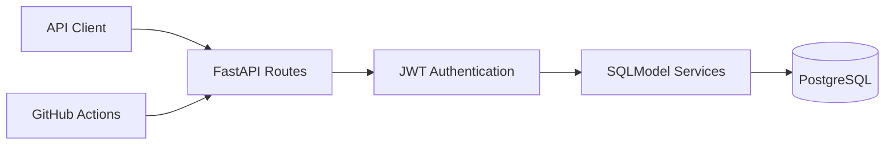

# TaskFlow API

[](https://github.com/PhilipOkeke/taskflow-backend-api/actions/workflows/ci.yml)

A task management REST API portfolio project built with Python, FastAPI, SQLModel, PostgreSQL, and SQLite. The project demonstrates backend development, database persistence, input validation, filtering, pagination, automated testing, containerization, and continuous integration.

## Why This Project

TaskFlow was created as a focused backend portfolio project. It shows how a small API can still use professional engineering practices: a clear project structure, typed models, request-scoped database sessions, consistent HTTP responses, automated quality checks, and documentation that lets another developer run the service quickly.


## Architecture




## Live Deployment

- **Live API:** https://taskflow-api-2iyx.onrender.com
- **Interactive Swagger docs:** https://taskflow-api-2iyx.onrender.com/docs
- **Health check:** https://taskflow-api-2iyx.onrender.com/health
- **Hosting:** Render Free Web Service
- **Database:** Render PostgreSQL with Alembic migrations

> The free web service can take about a minute to wake after inactivity. The free PostgreSQL database is intended for portfolio demonstration and expires on September 21, 2026.

## Features

- Create, read, update, and delete tasks
- Track task status and priority
- Search task titles and descriptions
- Filter by status and priority
- Paginate task collections
- Validate request bodies and query parameters
- Register users and authenticate requests with JWT access tokens
- Restrict task access to the authenticated owner
- Persist data through SQLModel using PostgreSQL or SQLite
- Manage database schema changes with Alembic
- Generate interactive OpenAPI documentation automatically
- Run API tests and coverage checks with PyTest
- Enforce linting and formatting with Ruff
- Build and run the service with Docker
- Test every push and pull request with GitHub Actions

## Technology Stack

| Area | Technology |
| --- | --- |
| Language | Python 3.12 |
| API framework | FastAPI |
| Data validation | Pydantic through SQLModel |
| Database and ORM | PostgreSQL, SQLite, and SQLModel/SQLAlchemy |
| Authentication | JWT access tokens and password hashing |
| Migrations | Alembic |
| Testing | PyTest, FastAPI TestClient, pytest-cov |
| Code quality | Ruff |
| Containerization | Docker and Docker Compose |
| CI/CD | GitHub Actions |

## API Endpoints

| Method | Endpoint | Purpose |
| --- | --- | --- |
| `GET` | `/` | Service information |
| `GET` | `/health` | Health check |
| `POST` | `/api/v1/auth/register` | Register an account |
| `POST` | `/api/v1/auth/token` | Obtain an access token |
| `GET` | `/api/v1/auth/me` | Retrieve the authenticated user |
| `POST` | `/api/v1/tasks` | Create a task |
| `GET` | `/api/v1/tasks` | List, filter, search, and paginate tasks |
| `GET` | `/api/v1/tasks/{task_id}` | Retrieve one task |
| `PATCH` | `/api/v1/tasks/{task_id}` | Partially update a task |
| `DELETE` | `/api/v1/tasks/{task_id}` | Delete a task |

## Run Locally on Windows

Open PowerShell in the project folder and run:

```powershell
python -m venv .venv
.\.venv\Scripts\Activate.ps1
python -m pip install --upgrade pip
pip install -e ".[dev]"
uvicorn app.main:app --reload
```

Then open:

- Interactive API documentation: <http://127.0.0.1:8000/docs>
- Alternative documentation: <http://127.0.0.1:8000/redoc>
- Health check: <http://127.0.0.1:8000/health>

If PowerShell blocks activation, run this once in the current PowerShell window:

```powershell
Set-ExecutionPolicy -Scope Process -ExecutionPolicy Bypass
```

## Run Locally on macOS or Linux

```bash
python3 -m venv .venv
source .venv/bin/activate
python -m pip install --upgrade pip
pip install -e ".[dev]"
uvicorn app.main:app --reload
```

## Try the API

First follow [Authentication](#authentication) to register and sign in. Then open <http://127.0.0.1:8000/docs>, authorize your session, expand a task endpoint, click **Try it out**, enter the request data, and click **Execute**.

Example request body for `POST /api/v1/tasks`:

```json
{
  "title": "Prepare portfolio project",
  "description": "Document and publish the TaskFlow API.",
  "status": "in_progress",
  "priority": "high"
}
```

Example using `curl` (set `ACCESS_TOKEN` to the token returned by the login endpoint):

```bash
curl -X POST "http://127.0.0.1:8000/api/v1/tasks" \
  -H "Authorization: Bearer $ACCESS_TOKEN" \
  -H "Content-Type: application/json" \
  -d '{"title":"Prepare portfolio project","status":"in_progress","priority":"high"}'
```

Filtering and pagination example:

```text
GET /api/v1/tasks?status=todo&priority=high&search=portfolio&limit=10&offset=0
```

## Run Automated Checks

```bash
ruff check .
ruff format --check .
pytest
```

The test configuration requires at least 90% application-code coverage.

## Run With Docker

```bash
docker compose up --build
```

The API will be available at <http://127.0.0.1:8000/docs>. Docker Compose runs PostgreSQL and stores its data in a named volume. The supplied credentials and signing key are for local development only.

## Project Structure

```text
taskflow-backend-api/
├── .github/workflows/ci.yml   # Automated linting, formatting, and tests
├── app/
│   ├── config.py              # Environment-based configuration
│   ├── crud.py                # Database operations
│   ├── database.py            # Engine and session management
│   ├── main.py                # Application factory and service endpoints
│   ├── models.py              # Database and request/response models
│   └── routes.py              # Versioned task endpoints
├── tests/                     # End-to-end API tests
├── Dockerfile
├── docker-compose.yml
├── pyproject.toml
└── README.md
```

## Authentication

Task endpoints require a bearer token.

1. Register an account:

```http
POST /api/v1/auth/register
Content-Type: application/json

{
  "email": "developer@example.com",
  "full_name": "Example Developer",
  "password": "a-secure-password"
}
```

2. Request an access token by sending the email as the OAuth2 `username` and the password to `POST /api/v1/auth/token`.
3. In Swagger UI, select **Authorize** and sign in with your registered email as the username and your password. For HTTP clients, send the returned token as `Authorization: Bearer <access_token>`.
4. Use the protected task endpoints. Each user can access only their own tasks.

The API also provides `GET /api/v1/auth/me` for the authenticated user's profile.

## PostgreSQL and migrations

Local tests continue to use isolated SQLite databases. Docker and hosted environments use PostgreSQL.

```bash
docker compose up --build
```

The container runs pending migrations before starting the API. To run migrations manually:

```bash
alembic upgrade head
```

Create future migrations with:

```bash
alembic revision --autogenerate -m "describe the schema change"
```

## Environment variables

Copy `.env.example` and supply environment-specific values. Never commit the real `SECRET_KEY`.

| Variable | Purpose |
| --- | --- |
| `DATABASE_URL` | SQLite or PostgreSQL SQLAlchemy connection URL |
| `SECRET_KEY` | Secret used to sign JWT access tokens |
| `ACCESS_TOKEN_MINUTES` | Access-token lifetime |
| `APP_NAME` | Display name shown in OpenAPI |
| `APP_VERSION` | Version reported by the service |

## Deploy to Render

The repository includes `render.yaml` for a Blueprint deployment containing:

- A Docker-based FastAPI web service
- A managed PostgreSQL database
- A generated JWT signing secret
- Automatic deployment from GitHub
- A `/health` health check

In Render, create a new Blueprint, connect this GitHub repository, and select `render.yaml`. Free Render services may sleep during inactivity, and free databases are intended for portfolio or evaluation use rather than production.

## Engineering Decisions

- **Application factory:** tests can create isolated application instances with temporary databases.
- **Request-scoped sessions:** every request receives its own database session, keeping transaction boundaries clear.
- **Separate API models:** create, update, database, and public response models have distinct responsibilities.
- **Partial updates:** `PATCH` changes only fields supplied by the client.
- **Versioned routes:** `/api/v1` leaves room for future API versions.
- **Automated quality gate:** CI rejects lint, formatting, test, or coverage failures.

## Possible Next Improvements

- Role-based permissions beyond per-user task ownership
- Structured application logging
- Rate limiting and production monitoring

## Author

**Philip Okeke**  
[Engr.philipokeke@gmail.com](mailto:Engr.philipokeke@gmail.com)  
[LinkedIn](https://www.linkedin.com/in/philip-okeke-8148a42a4)

## License

This project is available under the MIT License.
